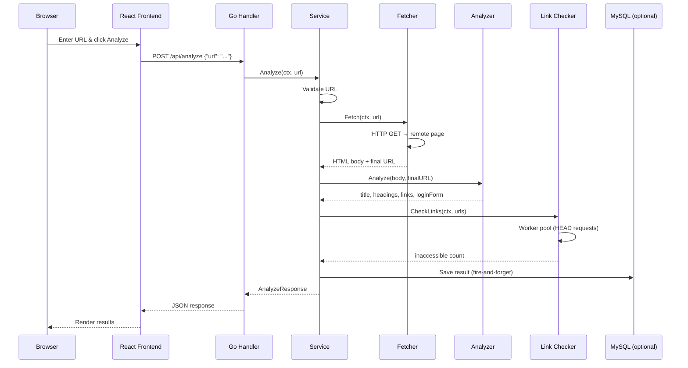
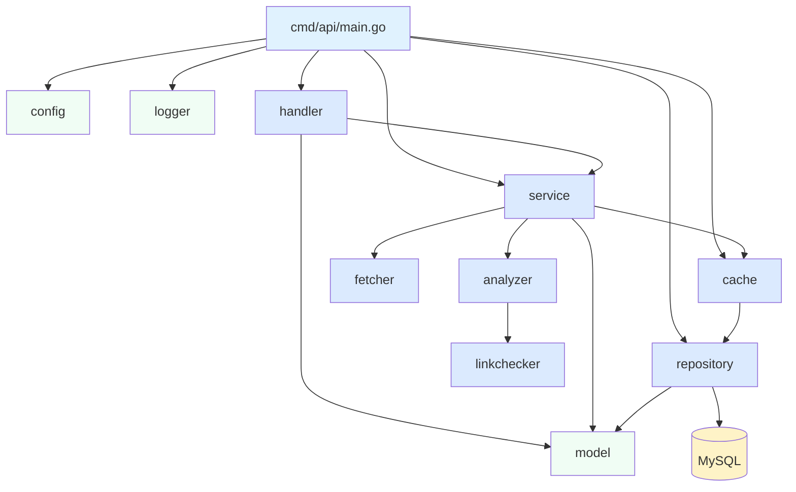
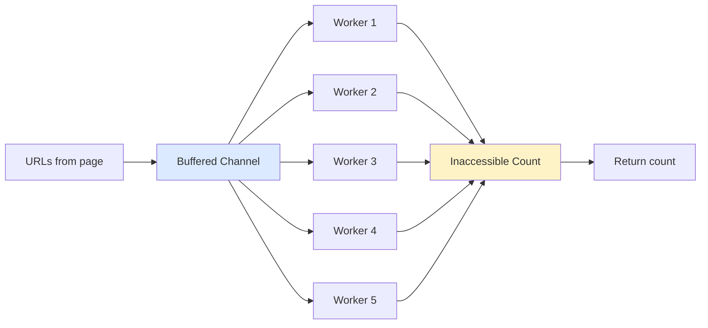
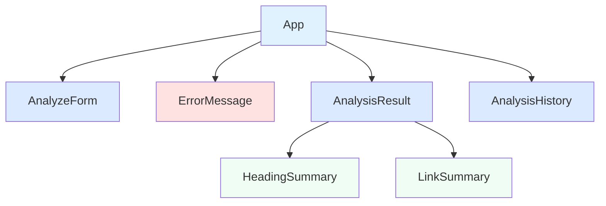

# Web Page Analyzer

A full-stack web application that analyzes any public URL and returns a structured summary of its HTML structure — including HTML version, page title, heading counts, link breakdown (internal, external, inaccessible), and login form detection.

## Tech Stack

- **Backend:** Go 1.26+, `net/http`, `golang.org/x/net/html`
- **Frontend:** React 19, TypeScript, Vite
- **Database:** MySQL 8+ (optional — the app works without it)

## Architecture

### Request Flow



### Backend Package Structure



### Worker Pool (Link Checker)



Each worker is a goroutine that pulls URLs from the channel and makes concurrent HEAD requests. A `sync.Mutex` protects the shared counter. The pool size is configurable via `MAX_LINK_CHECK_WORKERS`.

### Frontend Component Tree



App manages all state (`isLoading`, `result`, `error`, `history`) and passes data down to child components via props.

## Features

- **HTML Version Detection** — identifies HTML5, HTML 4.01, XHTML, or unknown doctypes
- **Title Extraction** — pulls the `<title>` tag content
- **Heading Analysis** — counts H1 through H6 tags
- **Link Analysis** — classifies links as internal or external, checks accessibility via concurrent HEAD requests using a worker pool
- **Login Form Detection** — detects `<input type="password">` fields and uses heuristics for SPA login pages
- **Analysis History** — stores past results in MySQL (when configured) and displays them in the UI, with an in-memory cache to avoid repeated DB queries

## Quick Start

### Prerequisites

- Go 1.26+
- Node.js 20+
- MySQL 8+ (optional)

### 1. Start the backend

```bash
cd backend
cp .env.example .env.local    # edit .env.local if needed
go run ./cmd/api
```

The API starts on `http://localhost:8080`.

> Detailed guide: [Backend Setup](docs/setup/backend/README.md)

### 2. Start the frontend

```bash
cd frontend
npm install
npm run dev
```

The dev server starts on `http://localhost:5173` and proxies `/api` requests to the backend.

> Detailed guide: [Frontend Setup](docs/setup/frontend/README.md)

### 3. Open the app

Visit `http://localhost:5173` in your browser, enter a URL, and click **Analyze**.

## API Endpoints

| Method | Path | Description |
|---|---|---|
| `POST` | `/api/analyze` | Analyze a URL |
| `GET` | `/api/analyses` | List past analyses (requires MySQL) |
| `GET` | `/health` | Health check |

### POST /api/analyze

**Request:**
```json
{
  "url": "https://example.com"
}
```

**Response:**
```json
{
  "url": "https://example.com",
  "htmlVersion": "HTML5",
  "title": "Example Domain",
  "headings": { "h1": 1, "h2": 0, "h3": 0, "h4": 0, "h5": 0, "h6": 0 },
  "links": { "internal": 0, "external": 1, "inaccessible": 0 },
  "hasLoginForm": false
}
```

## Environment Variables

| Variable | Default | Description |
|---|---|---|
| `PORT` | `8080` | Server port |
| `REQUEST_TIMEOUT` | `10s` | HTTP client timeout for fetching pages |
| `MAX_LINK_CHECK_WORKERS` | `5` | Concurrent link checker goroutines |
| `MAX_LINKS_TO_CHECK` | `50` | Maximum number of links to verify |
| `MYSQL_DSN` | _(empty)_ | MySQL connection string (optional) |
| `LOG_LEVEL` | `info` | Logging level (`debug`, `info`, `warn`, `error`) |

## Running Tests

```bash
cd backend
go test ./...
```

## Project Structure

```
├── backend/
│   ├── cmd/api/              # Application entrypoint
│   ├── internal/
│   │   ├── analyzer/         # HTML parsing and analysis
│   │   ├── config/           # Configuration loading
│   │   ├── fetcher/          # HTTP client for page fetching
│   │   ├── handler/          # HTTP handlers and routing
│   │   ├── logger/           # Structured logging setup
│   │   ├── model/            # Shared data types
│   │   ├── repository/       # MySQL persistence + in-memory cache (optional)
│   │   └── service/          # Business logic orchestration
│   ├── .env.example          # Example environment config
│   └── go.mod
├── frontend/
│   ├── src/
│   │   ├── api/              # API client
│   │   ├── components/       # React components
│   │   └── types/            # TypeScript types
│   ├── package.json
│   └── vite.config.ts
└── docs/
    └── setup/                # Setup guides
```

## License

MIT
